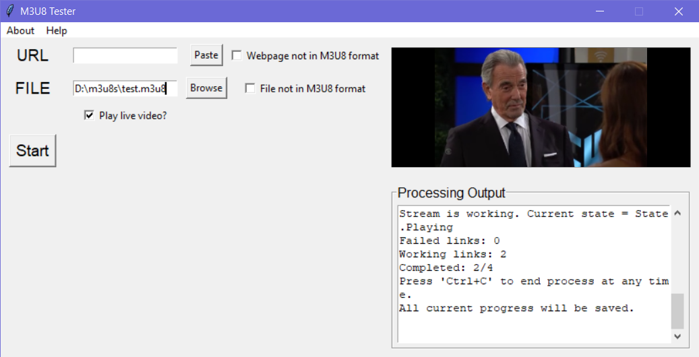
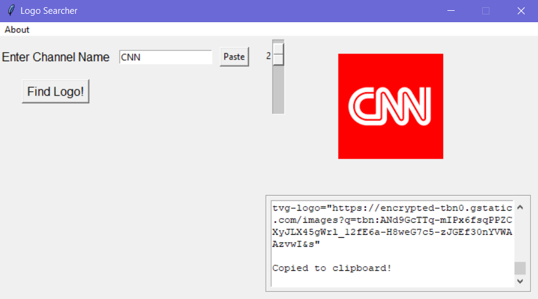

# m3u8-tester
program which tests m3u8 stream files (or any stream, really) and outputs working streams to a m3u8 file named by date and time (also outputs failed files to a separate file, so you can replace them if you choose to).

i created this program due to the fact that although many stream testers are available out there, none of them seem to have the simple option of outputting all working streams to a text file. i may be wrong, but it doesn't seem so.

many of these stream testers also don't have the flexibility of my m3u8-tester, which allows you to see the process in real time and see the number of streams which are working vs failing, and test streams regardless of the format they are in.

## [download](https://github.com/Slick9000/m3u8-tester/releases/latest)

## requirements
[requests](https://pypi.org/project/requests/)

[python-vlc](https://pypi.org/project/python-vlc/)

(m3u8 tester automatically installs these python packages if not installed)

[vlc](https://www.videolan.org/vlc/)

## **important things to note**

• users using the m3u8-tester.exe from the download page will only be required to download vlc, as **everything else is already included in the executable.**

• if you have the 64 bit version of python 3 installed, you are **required to install the 64 bit version of vlc for m3u8 tester to work.**

this is vice versa for **32 bit users.**

• if the source is not in m3u8 format, and you do not specify it is not (i.e. **option 3 - link not in m3u8 format, option 4 - file not in m3u8 format**, for using m3u8-tester.py from **command line**, or **webpage not in m3u8 format, file not in m3u8 format check box ☑ in the gui**), the output will not work properly and will result in empty lists, i.e []

this is due to the regex i use to get the m3u8 format **exactly like it was before.**

**e.g:**

#EXTINF tvg-logo={logo}, group-title={title}, channel-id={id}, {channel-name}

https://linktostream.m3u8

## documentation
there are comments all over the code within both the gui and main program files explaining literally everything. if there is anything you are unsure about, be sure to check in them.

## features

**command line usage**

you can give `m3u8 tester.py` **direct command line arguments**

**e.g:** `python "m3u8 tester.py" {option-number} "{link/file-path}"`

**gui version**

the gui version of m3u8 tester allows you to do the same thing as the command line script, but with a friendly interface. it also has an option to play the live stream's video in the gui. it is the way i recommend m3u8 tester to be used, and is the way the executable release is distributed.

**example:**



**cli version**

m3u8 tester was originally a cli (command-line interface) program, so there is `m3u8 tester cli.py`, in case you prefer that.

**e.g of the cli version: [link](https://pastebin.com/raw/SLZf7d4y)**

```
M3U8 Tester
Select a method to input data:
1 - Raw Webpage
2 - M3U/M3U8 File
3 - Raw Webpage with ONLY Links
4 - Raw File with ONLY Links
5 - Exit Program
: 3

Enter '/RETURN' to return to option selection
Input a link
: https://pastebin.com/raw/SLZf7d4y
Adding new data entries...
New entries added to masterdata file.
Loading 10 URLS...


Press 'Ctrl+C' to end process at any time.
All current progress will be saved.

Stream is dead. Current state = State.Ended
Failed links: 1
Working links: 0
Completed: 1/10
Press 'Ctrl+C' to end process at any time.
All current progress will be saved.
```
...and so on.

<br/>

## m3u8 tester options

**1: allows you to input a raw url formatted in m3u8 format**

**e.g:  [link](https://pastebin.pl/view/raw/f4892fcc)**

```
Adding new data entries...
New entries added to masterdata file.
Loading 383 URLS...


Press 'Ctrl+C' to end process at any time.
All current progress will be saved.

Stream is dead. Current state = State.Ended
Failed links: 1
Working links: 0
Completed: 1/383
Press 'Ctrl+C' to end process at any time.
All current progress will be saved.
```
...and so on.

<br/>

**2: allows you to input a file formatted in m3u8 format**

**e.g: test.m3u8**

**contents:**

```
#EXTM3U

#EXTINF:-1 tvg-logo="https://album.mediaset.es/file/10002/2017/11/21/energy_circular_500_-1_4048.png" group-title="SPAIN",Energy
https://mdslivehlsb-i.akamaihd.net/hls/live/623617/energy/bitrate_1.m3u8
```

```
Adding new data entries...
New entries added to masterdata file.
Loading 1 URLS...


Press 'Ctrl+C' to end process at any time.
All current progress will be saved.

Stream is dead. Current state = State.Ended
Failed links: 1
Working links: 0
Completed: 1/1
No links available.
Removing 17th May, 2022 (16-24-01).m3u8 from folder...
File removed.
```

<br/>

**3: allows you to input a url with links, and does not have to be in m3u8 format. it will pull all of the stream links, test them, and output them to a m3u8 file**

**e.g: [link](https://pastebin.com/raw/SLZf7d4y)**

```
Adding new data entries...
New entries added to masterdata file.
Loading 10 URLS...


Press 'Ctrl+C' to end process at any time.
All current progress will be saved.

Stream is dead. Current state = State.Ended
Failed links: 1
Working links: 0
Completed: 1/10
Press 'Ctrl+C' to end process at any time.
All current progress will be saved.
```
...and so on.

<br/>

**4: allows you to input a file with links, and does not have to be in m3u8 format. it will pull all of the stream links, test them, and output them to a m3u8 file**

**e.g: test2.m3u8 (this time, with a stream link that works lol)**

**contents:**

```
Stream 1: https://mdslivehlsb-i.akamaihd.net/hls/live/623617/energy/bitrate_1.m3u8
Stream 2: https://cnn-cnninternational-1-de.samsung.wurl.com/manifest/playlist.m3u8
```

```
Adding new data entries...
New entries added to masterdata file.
Loading 2 URLS...


Press 'Ctrl+C' to end process at any time.
All current progress will be saved.

Stream is dead. Current state = State.Ended
Failed links: 1
Working links: 0
Completed: 1/2
Press 'Ctrl+C' to end process at any time.
All current progress will be saved.

Stream is working. Current state = State.Playing
Failed links: 1
Working links: 1
Completed: 2/2
Link testing complete! Working links can be located in {current-working-directory}/17th May, 2022 (16-32-58).m3u8.
Failed links: 1/2
Working links: 1/2
Processing time: 0:00:16.110000

```

<br/>

## additional program: logo searcher

logo searcher is simple. you enter a channel name or click the paste button if you have it copied to clipboard, and click **find logo**.

the scroll bar allows you to select the first **20** results. it defaults to **1**.

**tvg-logo="{logo-url}"** is automatically copied to clipboard. all you have to do then, is just paste into your m3u8 file.

there's also a **preview** of the logo displayed so you can determine whether the logo selected is desirable to you.

**example:**


